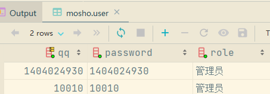

# 模块一在线测试网站：

**ink0.cn:520**

源码见群里我发的mosho.zip

注册面板只能注册普通用户，不可注册管理员账号，管理员账号只能由策划提供：

# 

# Bug


因 由QQ号自动获取QQ昵称的API接口 出现内部错误，昵称都显示成“昵称暂停使用”，昵称bug先不管，如果答辩前API服务商还没修好，那我再修。

# 安全测试 1/3：

经使用发现只有管理员才可以删除帖子，而普通用户不可以删帖。现黑客iris决定提权至管理员身份，以获取删除数据的权限。

经分析发现登陆面板index.php有一处Mysql上的select语句，具体指的是：输入QQ号和密码，系统会从数据库从查找是否存在该卡密，若存在则判定为卡密正确，并允许登录。根据iris的代码经验和不断用 ” 和 ’ 和 -- a 测试，发现登录面板存在SQL注入漏洞，iris猜测其SQL语句可能是

`select * from user where qq = "$qq" and password = "$password";`

以下是iris获取管理员账号的步骤：

1. 经信息收集发现该网站使用QQ号作为账号，\

2. 留言面板需要登录用户才能留言，所以留言面板最可能存在登录用户的信息，例如QQ号。

   

3. 在一番搜寻后发现复制留言者的头像链接得到`mosho.com/img/upload/qq_tou_xiang/1404024930.jpg`，不难猜测1404024930很可能就是留言者的QQ号，或曰：该网站存储用户头像时，头像的命名格式是QQ.jpg

4. 1404024930很可能就是内测人员 —— 管理员 的账号

 

提权：

Iris作为外来人员，现知道内部人员QQ账号是1404024930，不知道其密码，所以

Iris在QQ号栏输入  1404024930" -- a ，密码栏随便写比如写1，输入验证码后点击登录：


登录身份为管理员，提权成功：


原理分析：

模板SQL语句为：

select * from `user` where `qq` = "$qq" and `password` = "$password";

iris输入上述信息后，构成：

select * from `user` where `qq` = "1404024930" -- a " and `password` = "1";


成功注释掉—a后面的SQL语句。

 

# 安全加固 1/3

上述SQL注入漏洞源于登录面板未过滤掉英文的单双引号等特殊字符，所以网站开发者改进如下：

```
// 过滤函数，输入字符串，匹配到字符串含有以下特殊字符' " ( ) < > = 就去掉特殊字符，输出过滤后的字符串
function safety($str) {
    $arr = ['"', "'", "<", ">", "=", "(", ")"];
    foreach ($arr as $v) {
        $str = str_replace($v, '', $str);
    }
    return $str;
}
```

每当后端接收到前端发来的参数，例如登录者的QQ号，就用safety()函数过滤掉特殊字符。

```
$qq = $_POST['qq'] ?? null;
$qq = safety($qq);
```

## 测试验证

攻击者重复上述攻击操作然后点击登录：


结果被打回登陆界面了：


加固成功！
